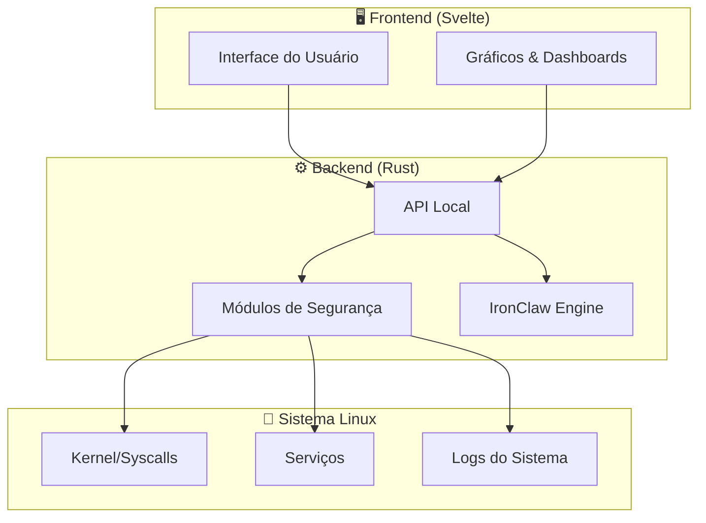
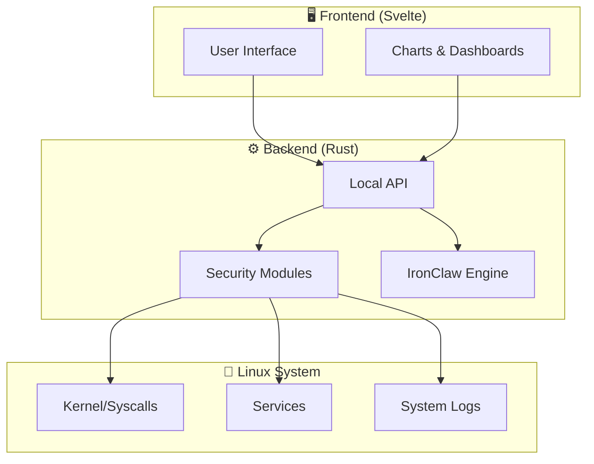

<div align="center">

[🇧🇷 Português](#-português) | [🇺🇸 English](#-english)

```
╔══════════════════════════════════════════════════════════════╗
║   _     _                    ____                           ║
║  | |   (_)_ __  _   ___  __/ ___|  ___  ___                ║
║  | |   | | '_ \| | | \ \/ /\___ \ / _ \/ __|               ║
║  | |___| | | | | |_| |>  <  ___) |  __/ (__                ║
║  |_____|_|_| |_|\__,_/_/\_\|____/ \___|\___|               ║
║                                                              ║
║          Home Command Center                                 ║
║          ━━━━━━━━━━━━━━━━━━━━                               ║
║   🛡️  Security Dashboard for Linux Home Users  🛡️           ║
╚══════════════════════════════════════════════════════════════╝
```

[](LICENSE)
[](https://www.rust-lang.org/)
[](https://svelte.dev/)
[](https://kernel.org)
[]()
[](CONTRIBUTING.md)

**Made with 🦀 Rust + Svelte | Open Source | Privacy-First | Offline-Capable**

</div>

---

# 🇧🇷 Português

> **Centro de Comando de Segurança para Linux** — Um painel unificado e leve para monitorar, proteger e gerenciar a segurança do seu sistema Linux doméstico, com assistente de IA integrado.

## 📑 Índice

- [Sobre](#sobre)
- [Funcionalidades](#-funcionalidades)
- [Arquitetura](#-arquitetura)
- [Screenshots](#-screenshots)
- [Requisitos do Sistema](#-requisitos-do-sistema)
- [Início Rápido](#-início-rápido)
- [Uso](#-uso)
- [IronClaw — Assistente IA](#-ironclaw--assistente-ia)
- [Filosofia de Segurança](#-filosofia-de-segurança)
- [Distribuições Suportadas](#-distribuições-suportadas)
- [Configuração](#-configuração)
- [Contribuindo](#-contribuindo)
- [Roadmap](#-roadmap)
- [FAQ](#-faq)
- [Licença](#-licença)
- [Autor](#-autor)
- [Agradecimentos](#-agradecimentos)

---

## Sobre

O **Linux Security Home Command Center** é uma aplicação desktop que centraliza o monitoramento e gerenciamento de segurança para usuários domésticos de Linux. Projetado para ser leve, funcionar offline e respeitar sua privacidade, ele transforma a complexidade da segurança Linux em uma interface intuitiva e acessível.

Diferente de soluções corporativas complexas, este projeto foca no usuário doméstico que quer proteger seu sistema sem precisar ser um especialista em segurança.

### Por que este projeto?

- 🏠 **Feito para casa** — Não é uma ferramenta enterprise adaptada; foi pensado para o desktop doméstico
- 🔒 **Privacidade primeiro** — Seus dados nunca saem do seu computador
- 📡 **Funciona offline** — Não depende de serviços em nuvem
- 🪶 **Leve** — Consome poucos recursos, roda até em hardware modesto
- 🎯 **Simples** — Interface clara, sem jargão desnecessário

---

## ✨ Funcionalidades

| Categoria | Funcionalidade | Status |
|-----------|---------------|--------|
| 🛡️ Firewall | Gerenciamento visual de regras (UFW/iptables) | 🔨 Em desenvolvimento |
| 📊 Monitor | Dashboard de processos e conexões em tempo real | 🔨 Em desenvolvimento |
| 🔐 Senhas | Auditoria de força de senhas do sistema | 📋 Planejado |
| 🌐 Rede | Scanner de portas e análise de tráfego | 📋 Planejado |
| 📦 Pacotes | Verificação de integridade e atualizações | 📋 Planejado |
| 🤖 IA | Assistente IronClaw para orientação de segurança | 📋 Planejado |
| 🔑 SSH | Gerenciamento de chaves e conexões | 📋 Planejado |
| 📝 Logs | Análise inteligente de logs do sistema | 📋 Planejado |
| 💾 Backup | Backup criptografado de configurações | 📋 Planejado |
| 🚨 Alertas | Notificações de eventos de segurança | 📋 Planejado |

---

## 🏗️ Arquitetura



> 📐 Para documentação detalhada da arquitetura, consulte [`docs/ARCHITECTURE.md`](docs/ARCHITECTURE.md)

---

## 📸 Screenshots

<div align="center">

> 🚧 Screenshots serão adicionados conforme o desenvolvimento avança.
>
> <!--  -->
> <!--  -->

</div>

---

## 💻 Requisitos do Sistema

<details>
<summary><strong>📋 Três perfis de instalação</strong></summary>

| Recurso | 🟢 Mínimo | 🟡 Padrão | 🔵 Completo |
|---------|-----------|-----------|-------------|
| **CPU** | 1 core | 2 cores | 4+ cores |
| **RAM** | 256 MB | 512 MB | 1 GB+ |
| **Disco** | 50 MB | 150 MB | 500 MB |
| **Display** | Terminal | 1024x768 | 1920x1080 |
| **Rede** | Opcional | Opcional | Recomendado |
| **Modo** | CLI apenas | GUI básica | GUI completa + IA |

### 🟢 Perfil Mínimo
- Ideal para servidores headless ou hardware antigo
- Apenas interface de linha de comando
- Monitoramento básico e firewall

### 🟡 Perfil Padrão (Recomendado)
- Interface gráfica completa
- Todos os módulos de segurança
- Funciona em qualquer desktop Linux moderno

### 🔵 Perfil Completo
- Inclui assistente IronClaw com modelo de IA local
- Análise avançada de ameaças
- Relatórios detalhados e exportação

</details>

---

## 🚀 Início Rápido

### Instalação a partir do código-fonte

```bash
# Clonar o repositório
git clone https://github.com/catitodev/linux-security-homecommandcenter.git
cd linux-security-homecommandcenter

# Instalar dependências de build (Debian/Ubuntu)
sudo apt install build-essential pkg-config libssl-dev

# Compilar o projeto
cargo build --release

# Instalar no sistema
sudo install -m 755 target/release/lshcc /usr/local/bin/
```

### Modo Pendrive (Portátil)

```bash
# Criar versão portátil para pendrive
cargo build --release --features portable

# Copiar para o pendrive (substitua /mnt/usb pelo ponto de montagem)
cp -r target/release/lshcc portable-config/ /mnt/usb/lshcc/

# Executar diretamente do pendrive
/mnt/usb/lshcc/lshcc --portable
```

### Primeira Execução

```bash
# Executar com interface gráfica
lshcc

# Executar em modo terminal
lshcc --tui

# Executar verificação rápida de segurança
lshcc --quick-scan

# Ver todas as opções
lshcc --help
```

---

## 📖 Uso

<details>
<summary><strong>Comandos principais</strong></summary>

```bash
# Dashboard interativo (padrão)
lshcc

# Verificar status geral de segurança
lshcc status

# Gerenciar firewall
lshcc firewall --status
lshcc firewall --enable
lshcc firewall --add-rule "allow 22/tcp"

# Monitorar conexões de rede
lshcc network --monitor
lshcc network --scan-ports

# Auditoria de segurança
lshcc audit --full
lshcc audit --quick

# Consultar assistente IA
lshcc ai "como proteger meu SSH?"

# Exportar relatório
lshcc report --format pdf --output ~/relatorio-seguranca.pdf
```

</details>

---

## 🤖 IronClaw — Assistente IA

O **IronClaw** é o assistente de inteligência artificial integrado ao Home Command Center. Ele funciona **100% offline** usando modelos de linguagem locais.

### Capacidades

- 💬 Responde perguntas sobre segurança Linux em linguagem natural
- 🔍 Analisa configurações e sugere melhorias
- 🚨 Explica alertas de segurança em termos simples
- 📚 Fornece tutoriais passo-a-passo personalizados
- 🛡️ Recomenda configurações baseadas no seu perfil de uso

### Filosofia do IronClaw

> O IronClaw nunca executa ações automaticamente. Ele **sugere** e **explica**, mas a decisão final é sempre do usuário.

```bash
# Iniciar conversa com IronClaw
lshcc ai

# Pergunta direta
lshcc ai "meu sistema está seguro?"

# Análise de configuração específica
lshcc ai --analyze /etc/ssh/sshd_config
```

---

## 🔐 Filosofia de Segurança

<div align="center">

| Princípio | Descrição |
|-----------|-----------|
| 🏠 **Local-first** | Dados processados e armazenados apenas localmente |
| 👁️ **Transparência** | Código aberto, auditável, sem telemetria |
| 🎓 **Educativo** | Explica o "porquê" de cada recomendação |
| ⚡ **Mínimo privilégio** | Solicita permissões apenas quando necessário |
| 🔄 **Não-destrutivo** | Nunca altera configurações sem confirmação explícita |

</div>

---

## 🐧 Distribuições Suportadas

<details>
<summary><strong>Lista de distribuições testadas</strong></summary>

| Distribuição | Versão | Status | Notas |
|-------------|--------|--------|-------|
| Ubuntu | 22.04+ | ✅ Suportado | Referência principal |
| Debian | 12+ | ✅ Suportado | |
| Fedora | 38+ | ✅ Suportado | |
| Arch Linux | Rolling | ✅ Suportado | |
| Linux Mint | 21+ | ✅ Suportado | |
| openSUSE | Leap 15.5+ | 🧪 Experimental | |
| Manjaro | Latest | 🧪 Experimental | |
| Pop!_OS | 22.04+ | 🧪 Experimental | |

> 💡 Em teoria, qualquer distribuição Linux com kernel 5.10+ e systemd deve funcionar.

</details>

---

## ⚙️ Configuração

O arquivo de configuração principal fica em `~/.config/lshcc/config.toml`:

```toml
[general]
language = "pt-BR"          # Idioma da interface
theme = "dark"              # dark | light | system
notifications = true        # Habilitar notificações desktop

[security]
scan_interval = 3600        # Intervalo de scan automático (segundos)
firewall_backend = "ufw"    # ufw | iptables | nftables
log_retention_days = 30     # Dias para manter logs

[ai]
enabled = false             # Habilitar assistente IronClaw
model = "local"             # local | none
max_memory_mb = 512         # Memória máxima para o modelo

[portable]
mode = false                # Modo pendrive
data_path = "./data"        # Caminho para dados em modo portátil
```

---

## 🤝 Contribuindo

Contribuições são muito bem-vindas! Veja como participar:

1. 🍴 Faça um fork do projeto
2. 🌿 Crie uma branch para sua feature (`git checkout -b feature/minha-feature`)
3. 💾 Commit suas mudanças (`git commit -m 'feat: adiciona minha feature'`)
4. 📤 Push para a branch (`git push origin feature/minha-feature`)
5. 🔃 Abra um Pull Request

<details>
<summary><strong>📋 Diretrizes de contribuição</strong></summary>

- Siga o estilo de código existente (use `cargo fmt` e `cargo clippy`)
- Adicione testes para novas funcionalidades
- Atualize a documentação quando necessário
- Use [Conventional Commits](https://www.conventionalcommits.org/) para mensagens de commit
- Seja respeitoso e construtivo nas discussões

</details>

> 📄 Veja [`CONTRIBUTING.md`](CONTRIBUTING.md) para diretrizes detalhadas.

---

## 🗺️ Roadmap

- [x] Estrutura inicial do projeto
- [x] Definição da arquitetura
- [ ] **v0.1** — Dashboard básico + monitor de processos
- [ ] **v0.2** — Gerenciamento de firewall (UFW)
- [ ] **v0.3** — Scanner de rede e portas
- [ ] **v0.4** — Auditoria de senhas e permissões
- [ ] **v0.5** — Análise de logs inteligente
- [ ] **v0.6** — Integração IronClaw (IA local)
- [ ] **v0.7** — Modo pendrive portátil
- [ ] **v0.8** — Sistema de alertas e notificações
- [ ] **v0.9** — Relatórios e exportação
- [ ] **v1.0** — Release estável 🎉

---

## ❓ FAQ

<details>
<summary><strong>Preciso ser root para usar?</strong></summary>

Não para a maioria das funções. Algumas operações específicas (como gerenciar firewall) solicitarão elevação de privilégio via `sudo` quando necessário.

</details>

<details>
<summary><strong>Funciona sem internet?</strong></summary>

Sim! O projeto foi desenhado para funcionar 100% offline. A conexão com internet é opcional e usada apenas para verificar atualizações de segurança (quando habilitado).

</details>

<details>
<summary><strong>É seguro instalar?</strong></summary>

O código é 100% aberto e auditável. Não há telemetria, coleta de dados ou conexões externas não autorizadas. Você pode compilar a partir do código-fonte e verificar por si mesmo.

</details>

<details>
<summary><strong>Substitui um antivírus?</strong></summary>

Não. Este é um centro de comando para gerenciar e monitorar a segurança do sistema. Ele complementa outras ferramentas de segurança, não as substitui.

</details>

<details>
<summary><strong>Funciona em servidores?</strong></summary>

Sim, no modo CLI/TUI. A interface gráfica requer um ambiente desktop, mas todas as funcionalidades estão disponíveis via terminal.

</details>

---

## 📄 Licença

Este projeto é licenciado sob a **Apache License 2.0** — veja o arquivo [`LICENSE`](LICENSE) para detalhes.

```
Copyright 2024-2026 catitodev

Licensed under the Apache License, Version 2.0
```

---

## 👤 Autor

**catitodev**

- GitHub: [@catitodev](https://github.com/catitodev)

---

## 🙏 Agradecimentos

- À comunidade Rust por ferramentas e bibliotecas incríveis
- À comunidade Svelte pela framework frontend elegante
- A todos os projetos open source de segurança que inspiraram este trabalho
- A todos os contribuidores e testadores

---
---


# 🇺🇸 English

> **Linux Security Home Command Center** — A unified, lightweight dashboard to monitor, protect, and manage your home Linux system's security, with an integrated AI assistant.

## 📑 Table of Contents

- [About](#about)
- [Key Features](#-key-features)
- [Architecture](#-architecture-overview)
- [Screenshots](#-screenshots-1)
- [System Requirements](#-system-requirements)
- [Quick Start](#-quick-start)
- [Usage](#-usage)
- [IronClaw AI Assistant](#-ironclaw--ai-assistant)
- [Security Philosophy](#-security-philosophy)
- [Supported Distributions](#-supported-distributions)
- [Configuration](#-configuration)
- [Contributing](#-contributing)
- [Roadmap](#-roadmap-1)
- [FAQ](#-faq-1)
- [License](#-license)
- [Author](#-author)
- [Acknowledgments](#-acknowledgments)

---

## About

**Linux Security Home Command Center** is a desktop application that centralizes security monitoring and management for Linux home users. Designed to be lightweight, work offline, and respect your privacy, it transforms the complexity of Linux security into an intuitive, accessible interface.

Unlike complex enterprise solutions, this project focuses on the home user who wants to protect their system without needing to be a security expert.

### Why this project?

- 🏠 **Built for home** — Not an adapted enterprise tool; designed for the home desktop
- 🔒 **Privacy first** — Your data never leaves your computer
- 📡 **Works offline** — No cloud service dependencies
- 🪶 **Lightweight** — Low resource consumption, runs even on modest hardware
- 🎯 **Simple** — Clean interface, no unnecessary jargon

---

## ✨ Key Features

| Category | Feature | Status |
|----------|---------|--------|
| 🛡️ Firewall | Visual rule management (UFW/iptables) | 🔨 In development |
| 📊 Monitor | Real-time process and connection dashboard | 🔨 In development |
| 🔐 Passwords | System password strength audit | 📋 Planned |
| 🌐 Network | Port scanner and traffic analysis | 📋 Planned |
| 📦 Packages | Integrity verification and updates | 📋 Planned |
| 🤖 AI | IronClaw assistant for security guidance | 📋 Planned |
| 🔑 SSH | Key and connection management | 📋 Planned |
| 📝 Logs | Intelligent system log analysis | 📋 Planned |
| 💾 Backup | Encrypted configuration backup | 📋 Planned |
| 🚨 Alerts | Security event notifications | 📋 Planned |

---

## 🏗️ Architecture Overview



> 📐 For detailed architecture documentation, see [`docs/ARCHITECTURE.md`](docs/ARCHITECTURE.md)

---

## 📸 Screenshots

<div align="center">

> 🚧 Screenshots will be added as development progresses.
>
> <!--  -->
> <!--  -->

</div>

---

## 💻 System Requirements

<details>
<summary><strong>📋 Three installation profiles</strong></summary>

| Resource | 🟢 Minimal | 🟡 Standard | 🔵 Full |
|----------|-----------|------------|---------|
| **CPU** | 1 core | 2 cores | 4+ cores |
| **RAM** | 256 MB | 512 MB | 1 GB+ |
| **Disk** | 50 MB | 150 MB | 500 MB |
| **Display** | Terminal | 1024x768 | 1920x1080 |
| **Network** | Optional | Optional | Recommended |
| **Mode** | CLI only | Basic GUI | Full GUI + AI |

### 🟢 Minimal Profile
- Ideal for headless servers or old hardware
- Command-line interface only
- Basic monitoring and firewall

### 🟡 Standard Profile (Recommended)
- Full graphical interface
- All security modules
- Works on any modern Linux desktop

### 🔵 Full Profile
- Includes IronClaw assistant with local AI model
- Advanced threat analysis
- Detailed reports and export

</details>

---

## 🚀 Quick Start

### Installation from source

```bash
# Clone the repository
git clone https://github.com/catitodev/linux-security-homecommandcenter.git
cd linux-security-homecommandcenter

# Install build dependencies (Debian/Ubuntu)
sudo apt install build-essential pkg-config libssl-dev

# Build the project
cargo build --release

# Install system-wide
sudo install -m 755 target/release/lshcc /usr/local/bin/
```

### Pendrive Mode (Portable)

```bash
# Build portable version for USB drive
cargo build --release --features portable

# Copy to USB drive (replace /mnt/usb with your mount point)
cp -r target/release/lshcc portable-config/ /mnt/usb/lshcc/

# Run directly from USB drive
/mnt/usb/lshcc/lshcc --portable
```

### First Run

```bash
# Run with graphical interface
lshcc

# Run in terminal mode
lshcc --tui

# Run quick security check
lshcc --quick-scan

# See all options
lshcc --help
```

---

## 📖 Usage

<details>
<summary><strong>Main commands</strong></summary>

```bash
# Interactive dashboard (default)
lshcc

# Check overall security status
lshcc status

# Manage firewall
lshcc firewall --status
lshcc firewall --enable
lshcc firewall --add-rule "allow 22/tcp"

# Monitor network connections
lshcc network --monitor
lshcc network --scan-ports

# Security audit
lshcc audit --full
lshcc audit --quick

# Query AI assistant
lshcc ai "how do I secure my SSH?"

# Export report
lshcc report --format pdf --output ~/security-report.pdf
```

</details>

---

## 🤖 IronClaw — AI Assistant

**IronClaw** is the artificial intelligence assistant integrated into the Home Command Center. It works **100% offline** using local language models.

### Capabilities

- 💬 Answers Linux security questions in natural language
- 🔍 Analyzes configurations and suggests improvements
- 🚨 Explains security alerts in simple terms
- 📚 Provides personalized step-by-step tutorials
- 🛡️ Recommends settings based on your usage profile

### IronClaw Philosophy

> IronClaw never executes actions automatically. It **suggests** and **explains**, but the final decision is always the user's.

```bash
# Start conversation with IronClaw
lshcc ai

# Direct question
lshcc ai "is my system secure?"

# Analyze specific configuration
lshcc ai --analyze /etc/ssh/sshd_config
```

---

## 🔐 Security Philosophy

<div align="center">

| Principle | Description |
|-----------|-------------|
| 🏠 **Local-first** | Data processed and stored only locally |
| 👁️ **Transparency** | Open source, auditable, no telemetry |
| 🎓 **Educational** | Explains the "why" behind every recommendation |
| ⚡ **Least privilege** | Requests permissions only when necessary |
| 🔄 **Non-destructive** | Never changes settings without explicit confirmation |

</div>

---

## 🐧 Supported Distributions

<details>
<summary><strong>List of tested distributions</strong></summary>

| Distribution | Version | Status | Notes |
|-------------|---------|--------|-------|
| Ubuntu | 22.04+ | ✅ Supported | Primary reference |
| Debian | 12+ | ✅ Supported | |
| Fedora | 38+ | ✅ Supported | |
| Arch Linux | Rolling | ✅ Supported | |
| Linux Mint | 21+ | ✅ Supported | |
| openSUSE | Leap 15.5+ | 🧪 Experimental | |
| Manjaro | Latest | 🧪 Experimental | |
| Pop!_OS | 22.04+ | 🧪 Experimental | |

> 💡 In theory, any Linux distribution with kernel 5.10+ and systemd should work.

</details>

---

## ⚙️ Configuration

The main configuration file is located at `~/.config/lshcc/config.toml`:

```toml
[general]
language = "en"             # Interface language
theme = "dark"              # dark | light | system
notifications = true        # Enable desktop notifications

[security]
scan_interval = 3600        # Auto-scan interval (seconds)
firewall_backend = "ufw"    # ufw | iptables | nftables
log_retention_days = 30     # Days to keep logs

[ai]
enabled = false             # Enable IronClaw assistant
model = "local"             # local | none
max_memory_mb = 512         # Maximum memory for the model

[portable]
mode = false                # USB drive mode
data_path = "./data"        # Data path in portable mode
```

---

## 🤝 Contributing

Contributions are very welcome! Here's how to participate:

1. 🍴 Fork the project
2. 🌿 Create a branch for your feature (`git checkout -b feature/my-feature`)
3. 💾 Commit your changes (`git commit -m 'feat: add my feature'`)
4. 📤 Push to the branch (`git push origin feature/my-feature`)
5. 🔃 Open a Pull Request

<details>
<summary><strong>📋 Contribution guidelines</strong></summary>

- Follow existing code style (use `cargo fmt` and `cargo clippy`)
- Add tests for new features
- Update documentation when necessary
- Use [Conventional Commits](https://www.conventionalcommits.org/) for commit messages
- Be respectful and constructive in discussions

</details>

> 📄 See [`CONTRIBUTING.md`](CONTRIBUTING.md) for detailed guidelines.

---

## 🗺️ Roadmap

- [x] Initial project structure
- [x] Architecture definition
- [ ] **v0.1** — Basic dashboard + process monitor
- [ ] **v0.2** — Firewall management (UFW)
- [ ] **v0.3** — Network and port scanner
- [ ] **v0.4** — Password and permissions audit
- [ ] **v0.5** — Intelligent log analysis
- [ ] **v0.6** — IronClaw integration (local AI)
- [ ] **v0.7** — Portable USB drive mode
- [ ] **v0.8** — Alert and notification system
- [ ] **v0.9** — Reports and export
- [ ] **v1.0** — Stable release 🎉

---

## ❓ FAQ

<details>
<summary><strong>Do I need root to use it?</strong></summary>

Not for most functions. Some specific operations (like managing the firewall) will request privilege elevation via `sudo` when necessary.

</details>

<details>
<summary><strong>Does it work without internet?</strong></summary>

Yes! The project was designed to work 100% offline. Internet connection is optional and used only to check for security updates (when enabled).

</details>

<details>
<summary><strong>Is it safe to install?</strong></summary>

The code is 100% open and auditable. There is no telemetry, data collection, or unauthorized external connections. You can build from source and verify for yourself.

</details>

<details>
<summary><strong>Does it replace an antivirus?</strong></summary>

No. This is a command center for managing and monitoring system security. It complements other security tools, it doesn't replace them.

</details>

<details>
<summary><strong>Does it work on servers?</strong></summary>

Yes, in CLI/TUI mode. The graphical interface requires a desktop environment, but all features are available via terminal.

</details>

---

## 📄 License

This project is licensed under the **Apache License 2.0** — see the [`LICENSE`](LICENSE) file for details.

```
Copyright 2024-2026 catitodev

Licensed under the Apache License, Version 2.0
```

---

## 👤 Author

**catitodev**

- GitHub: [@catitodev](https://github.com/catitodev)

---

## 🙏 Acknowledgments

- The Rust community for amazing tools and libraries
- The Svelte community for the elegant frontend framework
- All open source security projects that inspired this work
- All contributors and testers

---

<div align="center">

**⭐ If this project helps you, consider giving it a star! ⭐**

Made with ❤️ and 🦀 by [catitodev](https://github.com/catitodev)

</div>
