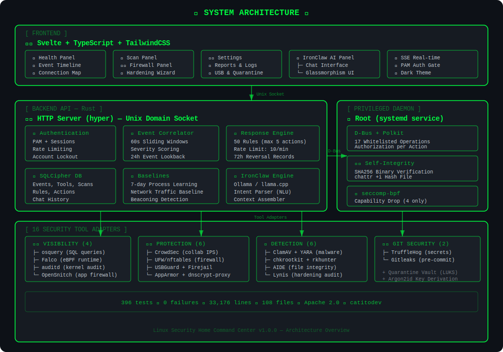

<div align="center">


<br/>


<br/>

[](LICENSE)
[](https://www.rust-lang.org/)
[](https://svelte.dev/)
[](https://kernel.org)
[](https://github.com/catitodev/linux-sec-home-command-center)
[]()
[](CONTRIBUTING.md)

**`> Made with 🦀 Rust + Svelte | Open Source | Privacy-First | Offline-Capable _`**

🔗 [`github.com/catitodev/linux-sec-home-command-center`](https://github.com/catitodev/linux-sec-home-command-center)

[🇧🇷 Leia em Português](README_PTBR.md)

</div>

---

# Linux Security Home Command Center

> **Linux Security Home Command Center** — A unified, lightweight dashboard to monitor, protect, and manage your home Linux system's security, with an integrated AI assistant.

## 📑 Table of Contents

- [About](#about)
- [Key Features](#-key-features)
- [Tech Stack](#-tech-stack)
- [Architecture](#-architecture)
- [System Requirements](#-system-requirements)
- [Quick Start](#-quick-start)
- [Tests](#-tests)
- [Usage](#-usage)
- [IronClaw AI Assistant](#-ironclaw--ai-assistant)
- [Security Philosophy](#-security-philosophy)
- [Supported Distributions](#-supported-distributions)
- [Configuration](#-configuration)
- [Contributing](#-contributing)
- [Roadmap](#-roadmap)
- [FAQ](#-faq)
- [License](#-license)
- [Author](#-author)
- [Acknowledgments](#-acknowledgments)

---

## About

**Linux Security Home Command Center** is a desktop application that centralizes security monitoring and management for Linux home users. Designed to be lightweight, work offline, and respect your privacy, it transforms the complexity of Linux security into an intuitive, accessible interface.

Unlike complex enterprise solutions, this project focuses on the home user who wants to protect their system without needing to be a security expert.

### Why this project?

- 🏠 **Built for home** — Not an adapted enterprise tool; designed for the home desktop
- 🔒 **Privacy first** — Your data never leaves your computer
- 📡 **Works offline** — No cloud service dependencies
- 🪶 **Lightweight** — Low resource consumption, runs even on modest hardware
- 🎯 **Simple** — Clean interface, no unnecessary jargon

---

## ✨ Key Features

| Category | Feature | Status |
|----------|---------|--------|
| 🛡️ Firewall | Visual rule management (UFW/nftables) | ✅ Implemented |
| 📊 Monitor | Real-time process and connection dashboard | ✅ Implemented |
| 🔐 Passwords | Password strength and SSH audit | ✅ Implemented |
| 🌐 Network | Connection mapping and anomaly detection | ✅ Implemented |
| 📦 Packages | Integrity verification (supply chain) | ✅ Implemented |
| 🤖 AI | IronClaw Assistant (local LLM + external API) | ✅ Implemented |
| 🔑 SSH | Configuration audit and monitoring | ✅ Implemented |
| 📝 Logs | Log analysis with event correlation | ✅ Implemented |
| 💾 Backup | Btrfs snapshots and rollback | ✅ Implemented |
| 🚨 Alerts | Notifications and automated response | ✅ Implemented |
| 🦠 Antivirus | ClamAV + YARA with custom rules | ✅ Implemented |
| 🔍 Rootkit | Detection with chkrootkit + rkhunter | ✅ Implemented |
| 📁 Integrity | AIDE monitoring of critical files | ✅ Implemented |
| 🏰 Hardening | Lynis audit with Health Score | ✅ Implemented |
| 🔒 USB | Device control (USBGuard) | ✅ Implemented |
| 🧪 Sandbox | App isolation (Firejail) | ✅ Implemented |
| 🌍 DNS | Encrypted DNS (dnscrypt-proxy) | ✅ Implemented |
| 🕵️ Secrets | Git credential scanning (TruffleHog + Gitleaks) | ✅ Implemented |

---

## 🔧 Tech Stack

| Layer | Technology |
|-------|-----------|
| **Backend** | Rust (static binary, musl libc) |
| **Frontend** | Svelte + TypeScript + TailwindCSS |
| **Database** | SQLite + SQLCipher (encrypted) |
| **IPC** | D-Bus + Polkit |
| **AI** | Ollama / llama.cpp (local LLM) |
| **Transport** | Unix domain socket (no TCP exposure) |

---

## 🏗️ Architecture

<div align="center">

</div>

> 📐 3-tier architecture: Frontend (Svelte + TailwindCSS) → Backend API (Rust, Unix socket) → Privileged Daemon (D-Bus + Polkit)

---

## 💻 System Requirements

<details>
<summary><strong>📋 Three installation profiles</strong></summary>

| Resource | 🟢 Minimal (Pendrive) | 🟡 Standard | 🔵 Full (with LLM) |
|----------|----------------------|-------------|---------------------|
| **CPU** | 1 core | 2 cores | 4+ cores |
| **RAM** | 1 GB | 4 GB | 8 GB |
| **Disk** | 4 GB | 16 GB | 32 GB+ |
| **Network** | Optional | Optional | Recommended |
| **Mode** | Portable (pendrive) | Full desktop | Desktop + local AI |

### 🟢 Minimal Profile (Pendrive Mode)
- Ideal for portable use on USB drives
- All security features included
- No local AI model

### 🟡 Standard Profile (Recommended)
- Full graphical interface with 8 views
- All 16 security modules
- Works on any modern Linux desktop

### 🔵 Full Profile (with LLM)
- Includes IronClaw assistant with local AI model (Ollama/llama.cpp)
- Advanced threat analysis with event correlation
- Baseline-based anomaly detection

</details>

---

## 🚀 Quick Start

### Installation from source

```bash
# Clone the repository
git clone https://github.com/catitodev/linux-sec-home-command-center.git
cd linux-sec-home-command-center

# Build the backend
cargo build --release

# Build the frontend
cd frontend && npm install && npm run build
```

### First Run

```bash
# Run with graphical interface
lshcc

# Run in terminal mode
lshcc --tui

# Run quick security check
lshcc --quick-scan

# See all options
lshcc --help
```

---

## 🧪 Tests

```
396 unit tests | 0 failures | 3 Rust crates + 1 doc-test
```

```bash
# Run all workspace tests (396 tests, 0 failures)
cargo test --workspace

# Check frontend types (0 errors, 0 warnings)
cd frontend && npx svelte-check
```

---

## 📖 Usage

<details>
<summary><strong>Main commands</strong></summary>

```bash
# Interactive dashboard (default)
lshcc

# Check overall security status
lshcc status

# Manage firewall
lshcc firewall --status
lshcc firewall --enable
lshcc firewall --add-rule "allow 22/tcp"

# Monitor network connections
lshcc network --monitor
lshcc network --scan-ports

# Security audit
lshcc audit --full
lshcc audit --quick

# Query AI assistant
lshcc ai "how do I secure my SSH?"

# Export report
lshcc report --format pdf --output ~/security-report.pdf
```

</details>

---

## 🤖 IronClaw — AI Assistant

**IronClaw** is the artificial intelligence assistant integrated into the Home Command Center. It works **100% offline** using local language models (Ollama/llama.cpp).

### Capabilities

- 💬 Answers Linux security questions in natural language
- 🔍 Analyzes configurations and suggests improvements
- 🚨 Explains security alerts in simple terms
- 📚 Provides personalized step-by-step tutorials
- 🛡️ Recommends settings based on your usage profile

### IronClaw Philosophy

> IronClaw never executes actions automatically. It **suggests** and **explains**, but the final decision is always the user's.

```bash
# Start conversation with IronClaw
lshcc ai

# Direct question
lshcc ai "is my system secure?"

# Analyze specific configuration
lshcc ai --analyze /etc/ssh/sshd_config
```

---

## 🔐 Security Philosophy

<div align="center">

| Principle | Description |
|-----------|-------------|
| 🏠 **Local-first** | Data processed and stored only locally |
| 👁️ **Transparency** | Open source, auditable, no telemetry |
| 🎓 **Educational** | Explains the "why" behind every recommendation |
| ⚡ **Least privilege** | Requests permissions only when necessary |
| 🔄 **Non-destructive** | Never changes settings without explicit confirmation |

</div>

---

## 🐧 Supported Distributions

<details>
<summary><strong>List of tested distributions</strong></summary>

| Distribution | Version | Status | Notes |
|-------------|---------|--------|-------|
| Ubuntu | 22.04+ | ✅ Supported | Primary reference |
| Debian | 12+ | ✅ Supported | |
| Fedora | 38+ | ✅ Supported | |
| Arch Linux | Rolling | ✅ Supported | |
| Linux Mint | 21+ | ✅ Supported | |
| openSUSE | Leap 15.5+ | 🧪 Experimental | |
| Manjaro | Latest | 🧪 Experimental | |
| Pop!_OS | 22.04+ | 🧪 Experimental | |

> 💡 In theory, any Linux distribution with kernel 5.10+ and systemd should work.

</details>

---

## ⚙️ Configuration

The main configuration file is located at `~/.config/lshcc/config.toml`:

```toml
[general]
language = "en"             # Interface language
theme = "dark"              # dark | light | system
notifications = true        # Enable desktop notifications

[security]
scan_interval = 3600        # Auto-scan interval (seconds)
firewall_backend = "ufw"    # ufw | iptables | nftables
log_retention_days = 30     # Days to keep logs

[ai]
enabled = false             # Enable IronClaw assistant
model = "local"             # local | none
max_memory_mb = 512         # Maximum memory for the model

[portable]
mode = false                # USB drive mode
data_path = "./data"        # Data path in portable mode
```

---

## 🤝 Contributing

Contributions are very welcome! Here's how to participate:

1. 🍴 Fork the project
2. 🌿 Create a branch for your feature (`git checkout -b feature/my-feature`)
3. 💾 Commit your changes (`git commit -m 'feat: add my feature'`)
4. 📤 Push to the branch (`git push origin feature/my-feature`)
5. 🔃 Open a Pull Request

<details>
<summary><strong>📋 Contribution guidelines</strong></summary>

- Follow existing code style (use `cargo fmt` and `cargo clippy`)
- Add tests for new features
- Update documentation when necessary
- Use [Conventional Commits](https://www.conventionalcommits.org/) for commit messages
- Be respectful and constructive in discussions

</details>

> 📄 See [`CONTRIBUTING.md`](CONTRIBUTING.md) for detailed guidelines.

---

## 🗺️ Roadmap

- [x] Initial project structure
- [x] Architecture definition
- [x] **v0.1** — Basic dashboard + process monitor
- [x] **v0.2** — Firewall management (UFW)
- [x] **v0.3** — Network and port scanner
- [x] **v0.4** — Password and permissions audit
- [x] **v0.5** — Intelligent log analysis
- [x] **v0.6** — IronClaw integration (local AI)
- [x] **v0.7** — Portable pendrive mode
- [x] **v0.8** — Alerts and notifications system
- [x] **v0.9** — Reports and export
- [x] **v1.0** — Stable release 🎉

---

## ❓ FAQ

<details>
<summary><strong>Do I need root to use it?</strong></summary>

Not for most functions. Privileged operations are mediated by the daemon via D-Bus + Polkit, requesting authorization only when necessary.

</details>

<details>
<summary><strong>Does it work without internet?</strong></summary>

Yes! The project was designed to work 100% offline. Internet connection is optional and used only to check for security updates (when enabled).

</details>

<details>
<summary><strong>Is it safe to install?</strong></summary>

The code is 100% open and auditable. There is no telemetry, data collection, or unauthorized external connections. You can build from source and verify for yourself.

</details>

<details>
<summary><strong>Does it replace an antivirus?</strong></summary>

It integrates ClamAV and YARA for malware scanning, plus rootkit detection. It's a complete command center that orchestrates multiple security tools.

</details>

<details>
<summary><strong>Does it work on servers?</strong></summary>

Yes, in CLI/TUI mode. The graphical interface requires a desktop environment, but all features are available via terminal.

</details>

---

## 📄 License

This project is licensed under the **Apache License 2.0** — see the [`LICENSE`](LICENSE) file for details.

```
Copyright 2024-2026 catitodev

Licensed under the Apache License, Version 2.0
```

---

## 👤 Author

**catitodev**

- GitHub: [@catitodev](https://github.com/catitodev)

---

## 🙏 Acknowledgments

- The Rust community for amazing tools and libraries
- The Svelte community for the elegant frontend framework
- All open source security projects that inspired this work
- All contributors and testers

---

<div align="center">

**⭐ If this project helps you, consider giving it a star! ⭐**

Made with ❤️ and 🦀 by [catitodev](https://github.com/catitodev)

</div>
