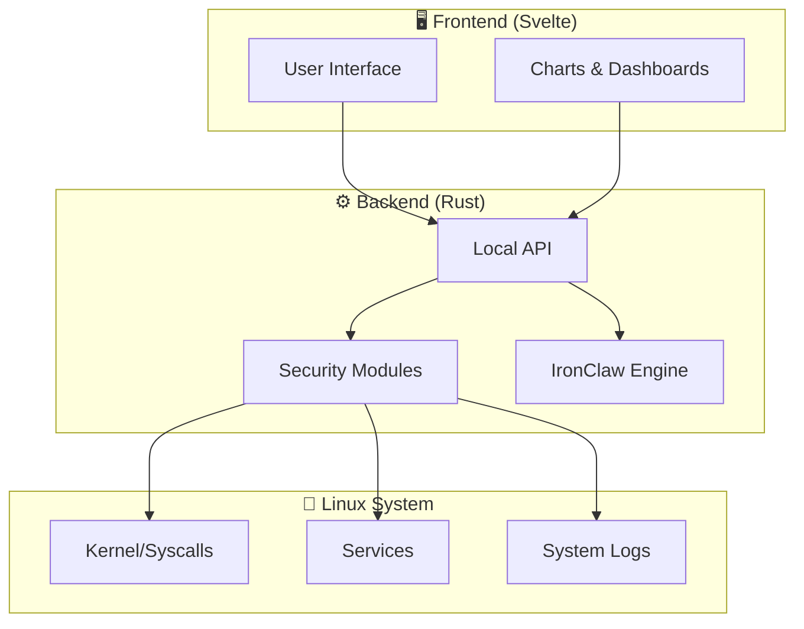

<div align="center">

```
╔══════════════════════════════════════════════════════════════╗
║   _     _                    ____                           ║
║  | |   (_)_ __  _   ___  __/ ___|  ___  ___                ║
║  | |   | | '_ \| | | \ \/ /\___ \ / _ \/ __|               ║
║  | |___| | | | | |_| |>  <  ___) |  __/ (__                ║
║  |_____|_|_| |_|\__,_/_/\_\|____/ \___|\___|               ║
║                                                              ║
║          Home Command Center                                 ║
║          ━━━━━━━━━━━━━━━━━━━━                               ║
║   🛡️  Security Dashboard for Linux Home Users  🛡️           ║
╚══════════════════════════════════════════════════════════════╝
```

[](LICENSE)
[](https://www.rust-lang.org/)
[](https://svelte.dev/)
[](https://kernel.org)
[]()
[](CONTRIBUTING.md)

**Made with 🦀 Rust + Svelte | Open Source | Privacy-First | Offline-Capable**

[🇧🇷 Leia em Português](README_PTBR.md)

</div>

---

# Linux Security Home Command Center

> A unified, lightweight dashboard to monitor, protect, and manage your home Linux system's security, with an integrated AI assistant.

## 📑 Table of Contents

- [About](#about)
- [Key Features](#-key-features)
- [Architecture](#-architecture-overview)
- [Screenshots](#-screenshots)
- [System Requirements](#-system-requirements)
- [Quick Start](#-quick-start)
- [Usage](#-usage)
- [IronClaw AI Assistant](#-ironclaw--ai-assistant)
- [Security Philosophy](#-security-philosophy)
- [Supported Distributions](#-supported-distributions)
- [Configuration](#-configuration)
- [Contributing](#-contributing)
- [Roadmap](#-roadmap)
- [FAQ](#-faq)
- [License](#-license)
- [Author](#-author)
- [Acknowledgments](#-acknowledgments)

---

## About

**Linux Security Home Command Center** is a desktop application that centralizes security monitoring and management for Linux home users. Designed to be lightweight, work offline, and respect your privacy, it transforms the complexity of Linux security into an intuitive, accessible interface.

Unlike complex enterprise solutions, this project focuses on the home user who wants to protect their system without needing to be a security expert.

### Why this project?

- 🏠 **Built for home** — Not an adapted enterprise tool; designed for the home desktop
- 🔒 **Privacy first** — Your data never leaves your computer
- 📡 **Works offline** — No cloud service dependencies
- 🪶 **Lightweight** — Low resource consumption, runs even on modest hardware
- 🎯 **Simple** — Clean interface, no unnecessary jargon

---

## ✨ Key Features

| Category | Feature | Status |
|----------|---------|--------|
| 🛡️ Firewall | Visual rule management (UFW/iptables) | 🔨 In development |
| 📊 Monitor | Real-time process and connection dashboard | 🔨 In development |
| 🔐 Passwords | System password strength audit | 📋 Planned |
| 🌐 Network | Port scanner and traffic analysis | 📋 Planned |
| 📦 Packages | Integrity verification and updates | 📋 Planned |
| 🤖 AI | IronClaw assistant for security guidance | 📋 Planned |
| 🔑 SSH | Key and connection management | 📋 Planned |
| 📝 Logs | Intelligent system log analysis | 📋 Planned |
| 💾 Backup | Encrypted configuration backup | 📋 Planned |
| 🚨 Alerts | Security event notifications | 📋 Planned |

---

## 🏗️ Architecture Overview



> 📐 For detailed architecture documentation, see [`docs/ARCHITECTURE.md`](docs/ARCHITECTURE.md)

---

## 📸 Screenshots

<div align="center">

> 🚧 Screenshots will be added as development progresses.
>
> <!--  -->
> <!--  -->

</div>

---

## 💻 System Requirements

<details>
<summary><strong>📋 Three installation profiles</strong></summary>

| Resource | 🟢 Minimal | 🟡 Standard | 🔵 Full |
|----------|-----------|------------|---------|
| **CPU** | 1 core | 2 cores | 4+ cores |
| **RAM** | 256 MB | 512 MB | 1 GB+ |
| **Disk** | 50 MB | 150 MB | 500 MB |
| **Display** | Terminal | 1024x768 | 1920x1080 |
| **Network** | Optional | Optional | Recommended |
| **Mode** | CLI only | Basic GUI | Full GUI + AI |

### 🟢 Minimal Profile
- Ideal for headless servers or old hardware
- Command-line interface only
- Basic monitoring and firewall

### 🟡 Standard Profile (Recommended)
- Full graphical interface
- All security modules
- Works on any modern Linux desktop

### 🔵 Full Profile
- Includes IronClaw assistant with local AI model
- Advanced threat analysis
- Detailed reports and export

</details>

---

## 🚀 Quick Start

### Installation from source

```bash
# Clone the repository
git clone https://github.com/catitodev/linux-security-homecommandcenter.git
cd linux-security-homecommandcenter

# Install build dependencies (Debian/Ubuntu)
sudo apt install build-essential pkg-config libssl-dev

# Build the project
cargo build --release

# Install system-wide
sudo install -m 755 target/release/lshcc /usr/local/bin/
```

### Pendrive Mode (Portable)

```bash
# Build portable version for USB drive
cargo build --release --features portable

# Copy to USB drive (replace /mnt/usb with your mount point)
cp -r target/release/lshcc portable-config/ /mnt/usb/lshcc/

# Run directly from USB drive
/mnt/usb/lshcc/lshcc --portable
```

### First Run

```bash
# Run with graphical interface
lshcc

# Run in terminal mode
lshcc --tui

# Run quick security check
lshcc --quick-scan

# See all options
lshcc --help
```

---

## 📖 Usage

<details>
<summary><strong>Main commands</strong></summary>

```bash
# Interactive dashboard (default)
lshcc

# Check overall security status
lshcc status

# Manage firewall
lshcc firewall --status
lshcc firewall --enable
lshcc firewall --add-rule "allow 22/tcp"

# Monitor network connections
lshcc network --monitor
lshcc network --scan-ports

# Security audit
lshcc audit --full
lshcc audit --quick

# Query AI assistant
lshcc ai "how do I secure my SSH?"

# Export report
lshcc report --format pdf --output ~/security-report.pdf
```

</details>

---

## 🤖 IronClaw — AI Assistant

**IronClaw** is the artificial intelligence assistant integrated into the Home Command Center. It works **100% offline** using local language models.

### Capabilities

- 💬 Answers Linux security questions in natural language
- 🔍 Analyzes configurations and suggests improvements
- 🚨 Explains security alerts in simple terms
- 📚 Provides personalized step-by-step tutorials
- 🛡️ Recommends settings based on your usage profile

### IronClaw Philosophy

> IronClaw never executes actions automatically. It **suggests** and **explains**, but the final decision is always the user's.

```bash
# Start conversation with IronClaw
lshcc ai

# Direct question
lshcc ai "is my system secure?"

# Analyze specific configuration
lshcc ai --analyze /etc/ssh/sshd_config
```

---

## 🔐 Security Philosophy

<div align="center">

| Principle | Description |
|-----------|-------------|
| 🏠 **Local-first** | Data processed and stored only locally |
| 👁️ **Transparency** | Open source, auditable, no telemetry |
| 🎓 **Educational** | Explains the "why" behind every recommendation |
| ⚡ **Least privilege** | Requests permissions only when necessary |
| 🔄 **Non-destructive** | Never changes settings without explicit confirmation |

</div>

---

## 🐧 Supported Distributions

<details>
<summary><strong>List of tested distributions</strong></summary>

| Distribution | Version | Status | Notes |
|-------------|---------|--------|-------|
| Ubuntu | 22.04+ | ✅ Supported | Primary reference |
| Debian | 12+ | ✅ Supported | |
| Fedora | 38+ | ✅ Supported | |
| Arch Linux | Rolling | ✅ Supported | |
| Linux Mint | 21+ | ✅ Supported | |
| openSUSE | Leap 15.5+ | 🧪 Experimental | |
| Manjaro | Latest | 🧪 Experimental | |
| Pop!_OS | 22.04+ | 🧪 Experimental | |

> 💡 In theory, any Linux distribution with kernel 5.10+ and systemd should work.

</details>

---

## ⚙️ Configuration

The main configuration file is located at `~/.config/lshcc/config.toml`:

```toml
[general]
language = "en"             # Interface language
theme = "dark"              # dark | light | system
notifications = true        # Enable desktop notifications

[security]
scan_interval = 3600        # Auto-scan interval (seconds)
firewall_backend = "ufw"    # ufw | iptables | nftables
log_retention_days = 30     # Days to keep logs

[ai]
enabled = false             # Enable IronClaw assistant
model = "local"             # local | none
max_memory_mb = 512         # Maximum memory for the model

[portable]
mode = false                # USB drive mode
data_path = "./data"        # Data path in portable mode
```

---

## 🤝 Contributing

Contributions are very welcome! Here's how to participate:

1. 🍴 Fork the project
2. 🌿 Create a branch for your feature (`git checkout -b feature/my-feature`)
3. 💾 Commit your changes (`git commit -m 'feat: add my feature'`)
4. 📤 Push to the branch (`git push origin feature/my-feature`)
5. 🔃 Open a Pull Request

<details>
<summary><strong>📋 Contribution guidelines</strong></summary>

- Follow existing code style (use `cargo fmt` and `cargo clippy`)
- Add tests for new features
- Update documentation when necessary
- Use [Conventional Commits](https://www.conventionalcommits.org/) for commit messages
- Be respectful and constructive in discussions

</details>

> 📄 See [`CONTRIBUTING.md`](CONTRIBUTING.md) for detailed guidelines.

---

## 🗺️ Roadmap

- [x] Initial project structure
- [x] Architecture definition
- [ ] **v0.1** — Basic dashboard + process monitor
- [ ] **v0.2** — Firewall management (UFW)
- [ ] **v0.3** — Network and port scanner
- [ ] **v0.4** — Password and permissions audit
- [ ] **v0.5** — Intelligent log analysis
- [ ] **v0.6** — IronClaw integration (local AI)
- [ ] **v0.7** — Portable USB drive mode
- [ ] **v0.8** — Alert and notification system
- [ ] **v0.9** — Reports and export
- [ ] **v1.0** — Stable release 🎉

---

## ❓ FAQ

<details>
<summary><strong>Do I need root to use it?</strong></summary>

Not for most functions. Some specific operations (like managing the firewall) will request privilege elevation via `sudo` when necessary.

</details>

<details>
<summary><strong>Does it work without internet?</strong></summary>

Yes! The project was designed to work 100% offline. Internet connection is optional and used only to check for security updates (when enabled).

</details>

<details>
<summary><strong>Is it safe to install?</strong></summary>

The code is 100% open and auditable. There is no telemetry, data collection, or unauthorized external connections. You can build from source and verify for yourself.

</details>

<details>
<summary><strong>Does it replace an antivirus?</strong></summary>

No. This is a command center for managing and monitoring system security. It complements other security tools, it doesn't replace them.

</details>

<details>
<summary><strong>Does it work on servers?</strong></summary>

Yes, in CLI/TUI mode. The graphical interface requires a desktop environment, but all features are available via terminal.

</details>

---

## 📄 License

This project is licensed under the **Apache License 2.0** — see the [`LICENSE`](LICENSE) file for details.

```
Copyright 2024-2026 catitodev

Licensed under the Apache License, Version 2.0
```

---

## 👤 Author

**catitodev**

- GitHub: [@catitodev](https://github.com/catitodev)

---

## 🙏 Acknowledgments

- The Rust community for amazing tools and libraries
- The Svelte community for the elegant frontend framework
- All open source security projects that inspired this work
- All contributors and testers

---

<div align="center">

**⭐ If this project helps you, consider giving it a star! ⭐**

Made with ❤️ and 🦀 by [catitodev](https://github.com/catitodev)

</div>
