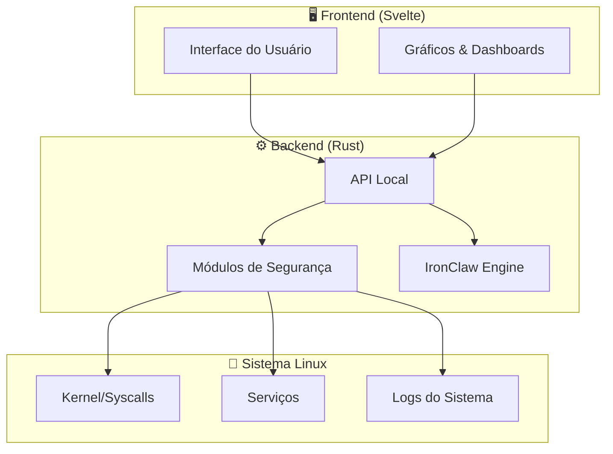

<div align="center">

```
╔══════════════════════════════════════════════════════════════╗
║   _     _                    ____                           ║
║  | |   (_)_ __  _   ___  __/ ___|  ___  ___                ║
║  | |   | | '_ \| | | \ \/ /\___ \ / _ \/ __|               ║
║  | |___| | | | | |_| |>  <  ___) |  __/ (__                ║
║  |_____|_|_| |_|\__,_/_/\_\|____/ \___|\___|               ║
║                                                              ║
║          Home Command Center                                 ║
║          ━━━━━━━━━━━━━━━━━━━━                               ║
║   🛡️  Painel de Segurança para Usuários Linux  🛡️           ║
╚══════════════════════════════════════════════════════════════╝
```

[](LICENSE)
[](https://www.rust-lang.org/)
[](https://svelte.dev/)
[](https://kernel.org)
[]()
[](CONTRIBUTING.md)

**Feito com 🦀 Rust + Svelte | Open Source | Privacidade Primeiro | Funciona Offline**

[🇺🇸 Read in English](README_EN.md)

</div>

---

# Linux Security Home Command Center

> **Centro de Comando de Segurança para Linux** — Um painel unificado e leve para monitorar, proteger e gerenciar a segurança do seu sistema Linux doméstico, com assistente de IA integrado.

## 📑 Índice

- [Sobre](#sobre)
- [Funcionalidades](#-funcionalidades)
- [Arquitetura](#-arquitetura)
- [Screenshots](#-screenshots)
- [Requisitos do Sistema](#-requisitos-do-sistema)
- [Início Rápido](#-início-rápido)
- [Uso](#-uso)
- [IronClaw — Assistente IA](#-ironclaw--assistente-ia)
- [Filosofia de Segurança](#-filosofia-de-segurança)
- [Distribuições Suportadas](#-distribuições-suportadas)
- [Configuração](#-configuração)
- [Contribuindo](#-contribuindo)
- [Roadmap](#-roadmap)
- [FAQ](#-faq)
- [Licença](#-licença)
- [Autor](#-autor)
- [Agradecimentos](#-agradecimentos)

---

## Sobre

O **Linux Security Home Command Center** é uma aplicação desktop que centraliza o monitoramento e gerenciamento de segurança para usuários domésticos de Linux. Projetado para ser leve, funcionar offline e respeitar sua privacidade, ele transforma a complexidade da segurança Linux em uma interface intuitiva e acessível.

Diferente de soluções corporativas complexas, este projeto foca no usuário doméstico que quer proteger seu sistema sem precisar ser um especialista em segurança.

### Por que este projeto?

- 🏠 **Feito para casa** — Não é uma ferramenta enterprise adaptada; foi pensado para o desktop doméstico
- 🔒 **Privacidade primeiro** — Seus dados nunca saem do seu computador
- 📡 **Funciona offline** — Não depende de serviços em nuvem
- 🪶 **Leve** — Consome poucos recursos, roda até em hardware modesto
- 🎯 **Simples** — Interface clara, sem jargão desnecessário

---

## ✨ Funcionalidades

| Categoria | Funcionalidade | Status |
|-----------|---------------|--------|
| 🛡️ Firewall | Gerenciamento visual de regras (UFW/iptables) | 🔨 Em desenvolvimento |
| 📊 Monitor | Dashboard de processos e conexões em tempo real | 🔨 Em desenvolvimento |
| 🔐 Senhas | Auditoria de força de senhas do sistema | 📋 Planejado |
| 🌐 Rede | Scanner de portas e análise de tráfego | 📋 Planejado |
| 📦 Pacotes | Verificação de integridade e atualizações | 📋 Planejado |
| 🤖 IA | Assistente IronClaw para orientação de segurança | 📋 Planejado |
| 🔑 SSH | Gerenciamento de chaves e conexões | 📋 Planejado |
| 📝 Logs | Análise inteligente de logs do sistema | 📋 Planejado |
| 💾 Backup | Backup criptografado de configurações | 📋 Planejado |
| 🚨 Alertas | Notificações de eventos de segurança | 📋 Planejado |

---

## 🏗️ Arquitetura



> 📐 Para documentação detalhada da arquitetura, consulte [`docs/ARCHITECTURE.md`](docs/ARCHITECTURE.md)

---

## 📸 Screenshots

<div align="center">

> 🚧 Screenshots serão adicionados conforme o desenvolvimento avança.
>
> <!--  -->
> <!--  -->

</div>

---

## 💻 Requisitos do Sistema

<details>
<summary><strong>📋 Três perfis de instalação</strong></summary>

| Recurso | 🟢 Mínimo | 🟡 Padrão | 🔵 Completo |
|---------|-----------|-----------|-------------|
| **CPU** | 1 core | 2 cores | 4+ cores |
| **RAM** | 256 MB | 512 MB | 1 GB+ |
| **Disco** | 50 MB | 150 MB | 500 MB |
| **Display** | Terminal | 1024x768 | 1920x1080 |
| **Rede** | Opcional | Opcional | Recomendado |
| **Modo** | CLI apenas | GUI básica | GUI completa + IA |

### 🟢 Perfil Mínimo
- Ideal para servidores headless ou hardware antigo
- Apenas interface de linha de comando
- Monitoramento básico e firewall

### 🟡 Perfil Padrão (Recomendado)
- Interface gráfica completa
- Todos os módulos de segurança
- Funciona em qualquer desktop Linux moderno

### 🔵 Perfil Completo
- Inclui assistente IronClaw com modelo de IA local
- Análise avançada de ameaças
- Relatórios detalhados e exportação

</details>

---

## 🚀 Início Rápido

### Instalação a partir do código-fonte

```bash
# Clonar o repositório
git clone https://github.com/catitodev/linux-security-homecommandcenter.git
cd linux-security-homecommandcenter

# Instalar dependências de build (Debian/Ubuntu)
sudo apt install build-essential pkg-config libssl-dev

# Compilar o projeto
cargo build --release

# Instalar no sistema
sudo install -m 755 target/release/lshcc /usr/local/bin/
```

### Modo Pendrive (Portátil)

```bash
# Criar versão portátil para pendrive
cargo build --release --features portable

# Copiar para o pendrive (substitua /mnt/usb pelo ponto de montagem)
cp -r target/release/lshcc portable-config/ /mnt/usb/lshcc/

# Executar diretamente do pendrive
/mnt/usb/lshcc/lshcc --portable
```

### Primeira Execução

```bash
# Executar com interface gráfica
lshcc

# Executar em modo terminal
lshcc --tui

# Executar verificação rápida de segurança
lshcc --quick-scan

# Ver todas as opções
lshcc --help
```

---

## 📖 Uso

<details>
<summary><strong>Comandos principais</strong></summary>

```bash
# Dashboard interativo (padrão)
lshcc

# Verificar status geral de segurança
lshcc status

# Gerenciar firewall
lshcc firewall --status
lshcc firewall --enable
lshcc firewall --add-rule "allow 22/tcp"

# Monitorar conexões de rede
lshcc network --monitor
lshcc network --scan-ports

# Auditoria de segurança
lshcc audit --full
lshcc audit --quick

# Consultar assistente IA
lshcc ai "como proteger meu SSH?"

# Exportar relatório
lshcc report --format pdf --output ~/relatorio-seguranca.pdf
```

</details>

---

## 🤖 IronClaw — Assistente IA

O **IronClaw** é o assistente de inteligência artificial integrado ao Home Command Center. Ele funciona **100% offline** usando modelos de linguagem locais.

### Capacidades

- 💬 Responde perguntas sobre segurança Linux em linguagem natural
- 🔍 Analisa configurações e sugere melhorias
- 🚨 Explica alertas de segurança em termos simples
- 📚 Fornece tutoriais passo-a-passo personalizados
- 🛡️ Recomenda configurações baseadas no seu perfil de uso

### Filosofia do IronClaw

> O IronClaw nunca executa ações automaticamente. Ele **sugere** e **explica**, mas a decisão final é sempre do usuário.

```bash
# Iniciar conversa com IronClaw
lshcc ai

# Pergunta direta
lshcc ai "meu sistema está seguro?"

# Análise de configuração específica
lshcc ai --analyze /etc/ssh/sshd_config
```

---

## 🔐 Filosofia de Segurança

<div align="center">

| Princípio | Descrição |
|-----------|-----------|
| 🏠 **Local-first** | Dados processados e armazenados apenas localmente |
| 👁️ **Transparência** | Código aberto, auditável, sem telemetria |
| 🎓 **Educativo** | Explica o "porquê" de cada recomendação |
| ⚡ **Mínimo privilégio** | Solicita permissões apenas quando necessário |
| 🔄 **Não-destrutivo** | Nunca altera configurações sem confirmação explícita |

</div>

---

## 🐧 Distribuições Suportadas

<details>
<summary><strong>Lista de distribuições testadas</strong></summary>

| Distribuição | Versão | Status | Notas |
|-------------|--------|--------|-------|
| Ubuntu | 22.04+ | ✅ Suportado | Referência principal |
| Debian | 12+ | ✅ Suportado | |
| Fedora | 38+ | ✅ Suportado | |
| Arch Linux | Rolling | ✅ Suportado | |
| Linux Mint | 21+ | ✅ Suportado | |
| openSUSE | Leap 15.5+ | 🧪 Experimental | |
| Manjaro | Latest | 🧪 Experimental | |
| Pop!_OS | 22.04+ | 🧪 Experimental | |

> 💡 Em teoria, qualquer distribuição Linux com kernel 5.10+ e systemd deve funcionar.

</details>

---

## ⚙️ Configuração

O arquivo de configuração principal fica em `~/.config/lshcc/config.toml`:

```toml
[general]
language = "pt-BR"          # Idioma da interface
theme = "dark"              # dark | light | system
notifications = true        # Habilitar notificações desktop

[security]
scan_interval = 3600        # Intervalo de scan automático (segundos)
firewall_backend = "ufw"    # ufw | iptables | nftables
log_retention_days = 30     # Dias para manter logs

[ai]
enabled = false             # Habilitar assistente IronClaw
model = "local"             # local | none
max_memory_mb = 512         # Memória máxima para o modelo

[portable]
mode = false                # Modo pendrive
data_path = "./data"        # Caminho para dados em modo portátil
```

---

## 🤝 Contribuindo

Contribuições são muito bem-vindas! Veja como participar:

1. 🍴 Faça um fork do projeto
2. 🌿 Crie uma branch para sua feature (`git checkout -b feature/minha-feature`)
3. 💾 Commit suas mudanças (`git commit -m 'feat: adiciona minha feature'`)
4. 📤 Push para a branch (`git push origin feature/minha-feature`)
5. 🔃 Abra um Pull Request

<details>
<summary><strong>📋 Diretrizes de contribuição</strong></summary>

- Siga o estilo de código existente (use `cargo fmt` e `cargo clippy`)
- Adicione testes para novas funcionalidades
- Atualize a documentação quando necessário
- Use [Conventional Commits](https://www.conventionalcommits.org/) para mensagens de commit
- Seja respeitoso e construtivo nas discussões

</details>

> 📄 Veja [`CONTRIBUTING.md`](CONTRIBUTING.md) para diretrizes detalhadas.

---

## 🗺️ Roadmap

- [x] Estrutura inicial do projeto
- [x] Definição da arquitetura
- [ ] **v0.1** — Dashboard básico + monitor de processos
- [ ] **v0.2** — Gerenciamento de firewall (UFW)
- [ ] **v0.3** — Scanner de rede e portas
- [ ] **v0.4** — Auditoria de senhas e permissões
- [ ] **v0.5** — Análise de logs inteligente
- [ ] **v0.6** — Integração IronClaw (IA local)
- [ ] **v0.7** — Modo pendrive portátil
- [ ] **v0.8** — Sistema de alertas e notificações
- [ ] **v0.9** — Relatórios e exportação
- [ ] **v1.0** — Release estável 🎉

---

## ❓ FAQ

<details>
<summary><strong>Preciso ser root para usar?</strong></summary>

Não para a maioria das funções. Algumas operações específicas (como gerenciar firewall) solicitarão elevação de privilégio via `sudo` quando necessário.

</details>

<details>
<summary><strong>Funciona sem internet?</strong></summary>

Sim! O projeto foi desenhado para funcionar 100% offline. A conexão com internet é opcional e usada apenas para verificar atualizações de segurança (quando habilitado).

</details>

<details>
<summary><strong>É seguro instalar?</strong></summary>

O código é 100% aberto e auditável. Não há telemetria, coleta de dados ou conexões externas não autorizadas. Você pode compilar a partir do código-fonte e verificar por si mesmo.

</details>

<details>
<summary><strong>Substitui um antivírus?</strong></summary>

Não. Este é um centro de comando para gerenciar e monitorar a segurança do sistema. Ele complementa outras ferramentas de segurança, não as substitui.

</details>

<details>
<summary><strong>Funciona em servidores?</strong></summary>

Sim, no modo CLI/TUI. A interface gráfica requer um ambiente desktop, mas todas as funcionalidades estão disponíveis via terminal.

</details>

---

## 📄 Licença

Este projeto é licenciado sob a **Apache License 2.0** — veja o arquivo [`LICENSE`](LICENSE) para detalhes.

```
Copyright 2024-2026 catitodev

Licensed under the Apache License, Version 2.0
```

---

## 👤 Autor

**catitodev**

- GitHub: [@catitodev](https://github.com/catitodev)

---

## 🙏 Agradecimentos

- À comunidade Rust por ferramentas e bibliotecas incríveis
- À comunidade Svelte pela framework frontend elegante
- A todos os projetos open source de segurança que inspiraram este trabalho
- A todos os contribuidores e testadores

---

<div align="center">

**⭐ Se este projeto te ajuda, considere dar uma estrela! ⭐**

Feito com ❤️ e 🦀 por [catitodev](https://github.com/catitodev)

</div>
